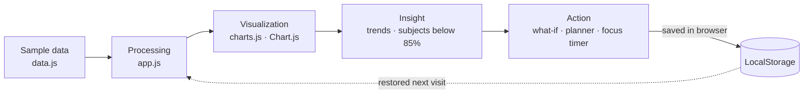
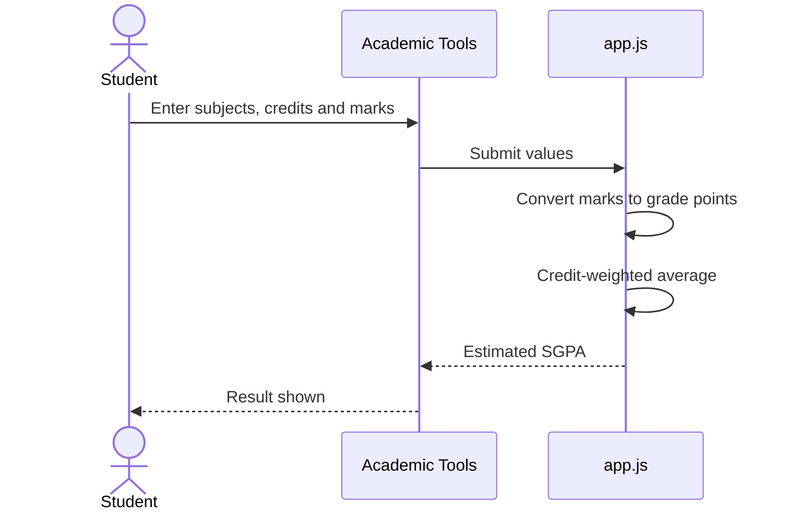
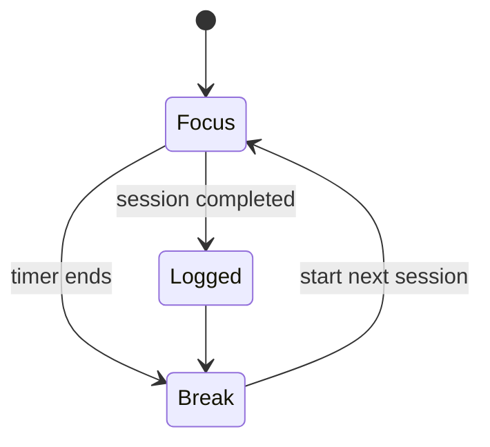
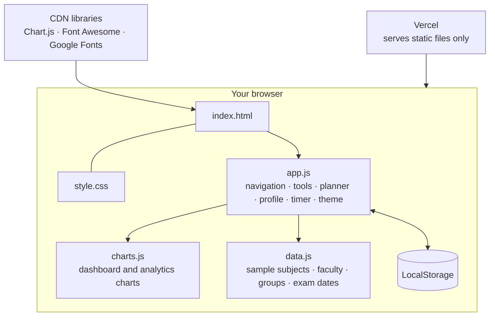
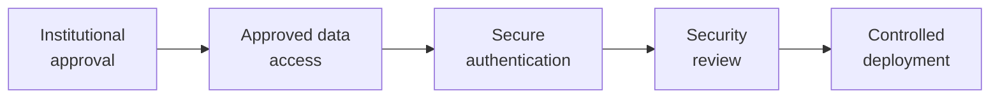
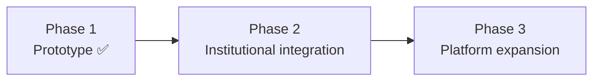

<div align="center">


<br>

[](https://halcyon-student-dashboard.vercel.app/)
[](#-roadmap)
[](#-tech-stack)


<br>

[**Features**](#-features) · [**How it works**](#-how-it-works) · [**Architecture**](#-architecture) · [**Tech stack**](#-tech-stack) · [**Privacy**](#-privacy-and-data) · [**Roadmap**](#-roadmap)

</div>

---

> [!WARNING]
> **Prototype notice.** HALCYON is an independently developed student project and a working
> frontend prototype. It is **not an official RYMEC application** and is not connected to any
> college system. The academic values shown in the app are sample content for demonstration.

---

## ✦ Overview

Students check attendance in one place, marks in another, tasks in a third, and study tools
somewhere else. **HALCYON puts them in one dashboard.** It also turns raw numbers into charts
and small tools you can act on, like "how many classes can I still miss?"

It is a fully client-side app written in plain HTML, CSS and JavaScript. No backend, no
framework, no build step.



---

## 🚀 Features

<table>
<tr>
<td width="50%" valign="top">

### 📊 Dashboard
A one-screen academic snapshot.

- Day streak and total subjects
- Overall attendance
- CIE overview
- Subjects below 85%
- College events
- Goals and progress

</td>
<td width="50%" valign="top">

### 📚 Academics
Everything about your semester.

- Attendance per subject
- Subjects and CIE marks
- Timetable
- Important dates
- Subject-wise analytics

</td>
</tr>
<tr>
<td valign="top">

### 🎓 Academic tools
Calculators that answer real questions.

- SGPA calculator
- Attendance what-if calculator
- Exam countdown
- Printable academic report

</td>
<td valign="top">

### 👨‍🏫 Faculty
Know who teaches what.

- Faculty directory
- Subject mapping
- Faculty detail view
- Star-rating interface, stored locally in your browser

</td>
</tr>
<tr>
<td valign="top">

### ⏱️ Focus timer
A Pomodoro system built in.

- Focus and break sessions
- Custom focus durations
- Session history
- Streak tracking

</td>
<td valign="top">

### 📝 Planner and notes
Stay organized.

- Tasks with subject, priority and date
- Filtering and completion progress
- Quick notes with an optional Google Drive link

</td>
</tr>
<tr>
<td valign="top">

### 👤 Profile
Make it yours.

- Editable name and bio
- Avatar selection
- Badges and progress

</td>
<td valign="top">

### 👥 Social hub
A prototype community area.

- Study groups
- Leaderboard
- Classmate search
- Link to an unofficial RYMEC student community

</td>
</tr>
</table>

<div align="center">

**🌙 Dark / light theme · 📱 Responsive layout · 📈 Interactive charts · 💾 Saves your settings**

</div>

---

## 🧠 How it works

<details open>
<summary><b>🎓 SGPA calculator</b></summary>
<br>

You enter each subject's credits and marks. JavaScript converts the marks to grade points and
calculates a credit-weighted **estimated** SGPA.



</details>

<details>
<summary><b>📅 Attendance what-if</b></summary>
<br>

It takes your attended and total classes and shows how your percentage changes if you attend
or miss the next classes, so you can plan before you fall below the limit.

</details>

<details>
<summary><b>⏱️ Pomodoro focus system</b></summary>
<br>



Completed sessions are added to your focus history and streak.

</details>

<details>
<summary><b>💾 Persistence</b></summary>
<br>

Your profile, avatar, planner, notes, ratings, theme and focus history are saved in your
browser's **LocalStorage**, so they are still there next time you visit.

</details>

---

## 🧩 Architecture



<details>
<summary><b>📁 Project structure</b></summary>
<br>

```text
HALCYON/
├── index.html
├── README.md
├── css/
│   └── style.css
├── js/
│   ├── app.js
│   ├── charts.js
│   └── data.js
├── images/
│   ├── profile.jpg
│   └── avatar-*.jpeg
└── audio/
    └── lofi-focus.mp3
```

<!-- Add the source and licence of lofi-focus.mp3 here, e.g. "Focus music: <title> by <artist>, <licence>" -->

</details>

---

## 🛠️ Tech stack

<div align="center">


</div>

| Technology | Purpose |
|---|---|
| **HTML5** | Page structure |
| **CSS3** | Layout, themes, animations, responsive design |
| **JavaScript** | Application logic and interactivity |
| **Chart.js** | Charts and data visualization |
| **Font Awesome** | Icons |
| **Google Fonts (Inter)** | Typography |
| **LocalStorage** | Client-side persistence |
| **Vercel** | Hosting |

### 🎨 Design palette

| | Name | Hex | Used for |
|---|---|---|---|
|  | HALCYON Blue | `#4F7DF3` | Primary accent |
|  | HALCYON Purple | `#6C63FF` | Secondary accent, gradients |
|  | HALCYON Violet | `#743CFF` | Gradients, highlights |
|  | HALCYON Dark | `#111827` | Dark theme background |

---

## 💻 Run locally

No installation needed.

```bash
git clone https://github.com/veereshr4446/HALCYON.git
cd HALCYON
# open index.html in your browser
```

For auto-reload while editing, use the VS Code **Live Server** extension.

---

## 🔐 Privacy and data

| | |
|---|---|
| 🚫 **No backend** | HALCYON does not send your data to any server of its own |
| 🏫 **No college access** | It does not connect to RYMEC's systems or scrape any private college data |
| 🧪 **Sample content** | Academic values, timetable, faculty list, study groups and classmate records are sample content for demonstration |
| 💾 **Stays in your browser** | Profile, planner, notes, ratings and settings are saved only in your own LocalStorage. Clearing browser data removes them |
| ⭐ **Ratings are local** | Faculty ratings are not official evaluations and are not shared with anyone |

Connecting HALCYON to real college data would need:



---

## 🔮 Roadmap



**Phase 1: Prototype** ✅
- [x] Dashboard, academic overview, attendance and CIE analytics
- [x] Timetable and faculty directory
- [x] SGPA calculator, attendance what-if, exam countdown, academic report
- [x] Pomodoro timer, planner and notes
- [x] Profile and avatars, dark / light mode
- [x] Social hub prototype and community link

**Phase 2: Institutional integration**
- [ ] Approved college data integration
- [ ] Secure student authentication and backend services
- [ ] Notifications and official announcements

**Phase 3: Platform expansion**
- [ ] Mobile app
- [ ] Advanced academic analytics
- [ ] Events and college bus information
- [ ] Expanded student collaboration

---

## 💡 Why HALCYON?

Most student tools only **show** information. HALCYON tries to go one step further:

> **Information → Insight → Action**

A student should not only see that attendance is low. They should understand what it means and
have tools right there to do something about it.

---

## 👨‍💻 Developer

<div align="center">

**Viresh Ranjanagi**
Computer Science & Engineering · RYMEC, Ballari

[](https://github.com/veereshr4446)
[](https://linkedin.com/in/-veeresh-ranjanagi)

</div>

---

## 📜 Disclaimer

HALCYON is an independently developed student project. It is not an official RYMEC application
and does not represent the institution. Any institutional deployment, branding or data
integration would need permission, authorization and a security review from the institution.

---

<div align="center">

### ⚡ HALCYON
*A simpler way to experience student life.*

<br>

Built with curiosity, code, and a lot of late-night debugging.


</div>
